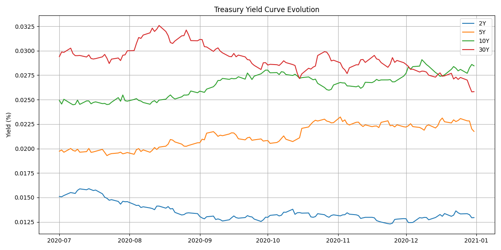

# 📈 Fixed Income Risk & Performance Dashboard

This project offers a complete **risk and performance monitoring dashboard** for a fixed income portfolio.  
It combines Python, Power BI, and Streamlit to visualize **DV01 exposure**, **daily PnL attribution**, and **historical Value at Risk (VaR)**.

---

## 🌐 Live Demo

[](https://fixed-income-risk-dashboard.streamlit.app/)
> 🔎 Interactive browser-based dashboard for real-time analysis <br>
> [https://fixed-income-risk-dashboard.streamlit.app/](https://fixed-income-risk-dashboard.streamlit.app/)


---

## 📷 Dashboard Preview




---

## 🧩 Key Features

- 📊 **PnL Attribution** by tenor (2Y, 5Y, 10Y, 30Y)
- 📉 **DV01 Risk Breakdown** across the curve
- ⚠️ **Historical VaR** with distribution plots
- 🖥️ **Power BI Dashboard** for advanced visualization
- 🌐 **Streamlit App** for a quick frontend interface

---

## 🚀 Quick Start

### 1. Clone the Repository

```bash
git clone https://github.com/muditvir/FI_risk_dashboard.git
cd FI_risk_dashboard
```

### 2. Install dependencies
```bash
pip install requirements.txt
```

### 3. Run the Streamlit App Locally
```bash
streamlit run app.py
```


